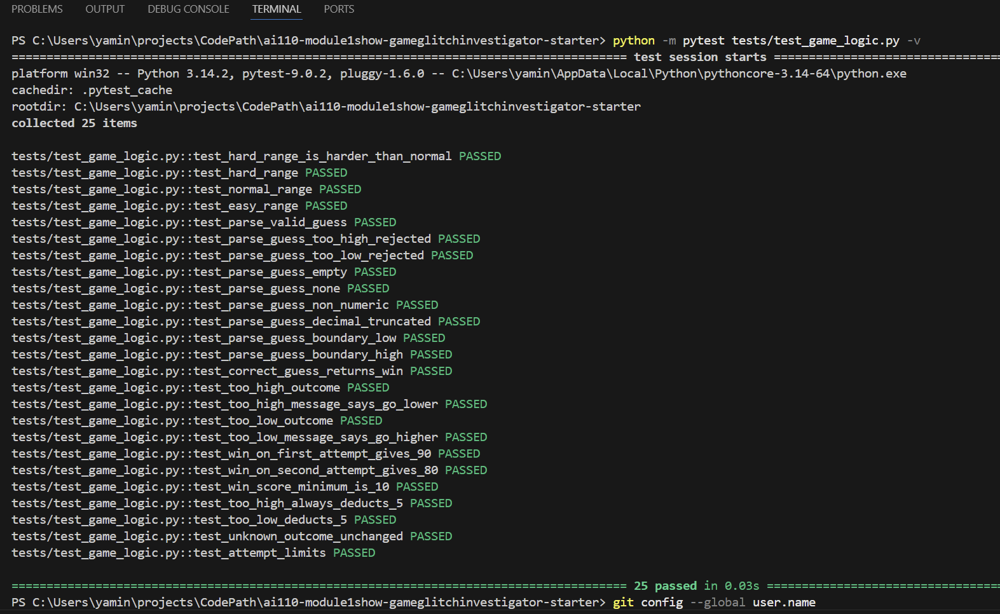

# 🎮 Game Glitch Investigator: The Impossible Guesser

## 🚨 The Situation

You asked an AI to build a simple "Number Guessing Game" using Streamlit.
It wrote the code, ran away, and now the game is unplayable. 

- You can't win.
- The hints lie to you.
- The secret number seems to have commitment issues.

## 🛠️ Setup

1. Install dependencies: `pip install -r requirements.txt`
2. Run the broken app: `python -m streamlit run app.py`

## 🕵️‍♂️ Your Mission

1. **Play the game.** Open the "Developer Debug Info" tab in the app to see the secret number. Try to win.
2. **Find the State Bug.** Why does the secret number change every time you click "Submit"? Ask ChatGPT: *"How do I keep a variable from resetting in Streamlit when I click a button?"*
3. **Fix the Logic.** The hints ("Higher/Lower") are wrong. Fix them.
4. **Refactor & Test.** - Move the logic into `logic_utils.py`.
   - Run `pytest` in your terminal.
   - Keep fixing until all tests pass!

## 📝 Document Your Experience

- Glitchy Guesser is a number guessing game built with Streamlit. The player picks a difficulty level (Easy, Normal, or Hard), each with a different number range and attempt limit, then tries to guess a randomly generated secret number. After each guess, the game gives a hint (Too High / Too Low) and updates a score. The player wins by guessing correctly before running out of attempts.
- 1	get_range_for_difficulty	Hard difficulty returned range 1–50, making it easier than Normal (1–100)
2	check_guess	Hint messages were swapped — Too High said "Go HIGHER", Too Low said "Go LOWER"
3	update_score	Wrong guesses on even-numbered attempts gave +5 bonus points instead of -5
4	update_score	Win score formula used attempt_number + 1, overcounting and reducing points unfairly
5	Session state init	attempts was initialized to 1, consuming the first attempt before any guess was made
6	Submit handler	Secret was cast to str on even attempts, causing broken string comparisons
7	Info banner	Range was hardcoded as "1 to 100" regardless of difficulty
8	New game handler	New game used hardcoded randint(1, 100) instead of the selected difficulty's range
9	New game handler	status and history were not reset on new game, blocking all future guesses via st.stop()
10	parse_guess	Guesses outside the valid range were accepted as valid
- Fixes Applied

Corrected Hard difficulty range to 1–500
Swapped the hint messages in check_guess to match the correct direction
Removed the even-attempt score bonus; wrong guesses always deduct 5 points
Removed the +1 offset from the win score formula
Changed attempts initialization from 1 to 0
Removed the int/str alternation — secret is always used as an int
Updated the info banner to use the dynamic low and high variables
Updated the new game handler to use randint(low, high) based on current difficulty
Added status and history resets to the new game handler
Added range validation to parse_guess with low and high parameters
Refactored all logic functions into logic_utils.py, keeping app.py as pure UI

## 📸 Demo

- .png>)

## 🚀 Stretch Features

- 
